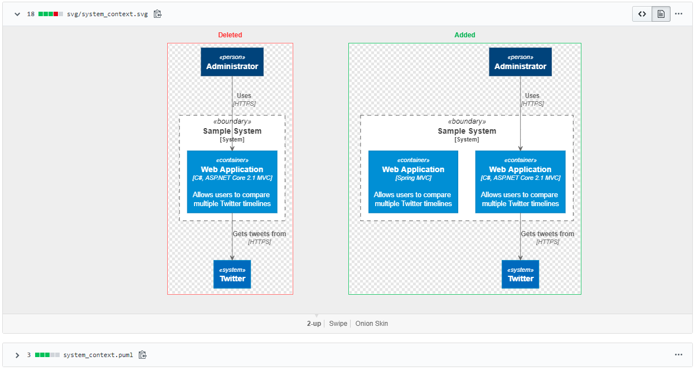

# Application Architecture template
Application architecture template documentation (Markdown)
> [C4-PlantUML](https://github.com/RicardoNiepel/C4-PlantUML)

> [C4-Model](https://www.mytechiebits.com/C4)

## Benefits
> * Define diagrams with plain text (PlantUML) - use code instead of drawing.
> * Use benefits of Version Control (GitHub/Bitbucket/..), compare difference between versions, approve pull requests and more other...
 
> * Include architecture, flows and other documentation diagrams to development code.

## Build on
>* Gradle 6.3
>* [PlantUML](https://mvnrepository.com/artifact/net.sourceforge.plantuml/plantuml) 1.2020.6
>* Markdown

## Requirements
> [Graphviz](https://www.graphviz.org/download/) (maybe needed for rendering certain diagrams, use a version defined [here](http://plantuml.com/graphviz-dot))

## How use it
* Create PlantUML file (with extension `puml`) in any location of project
* Run Gradle task `generateSVG` or `generatePNG`, this will generate SVG/PNG files from PlantUML files in same location,
will be created folders svg/png with all images with same name like PlantUML files
* Use this images in Markdown ``
* After any change in PlantUML files need rerun gradle task again.

#### Visualization without image generation
PlantUML content can't be visualization in github/bitbucket so has option `proxy`, bad solution for private repositories
`` 

## Example of Application Architecture documentation
[High Level Architecture](high-level-architecture.md)

